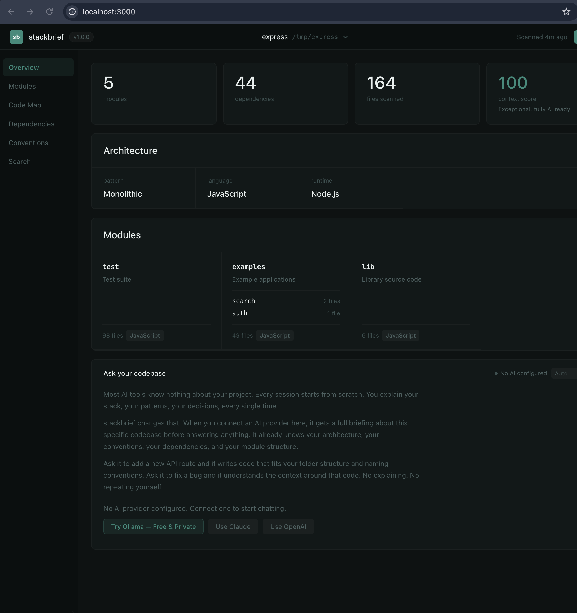
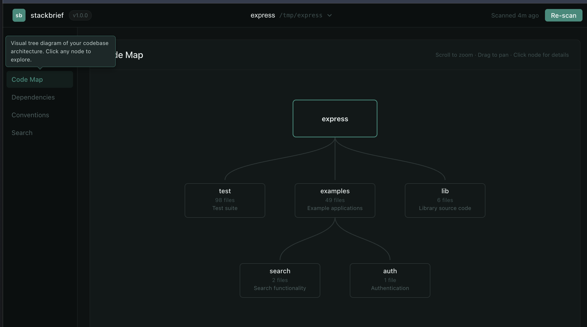
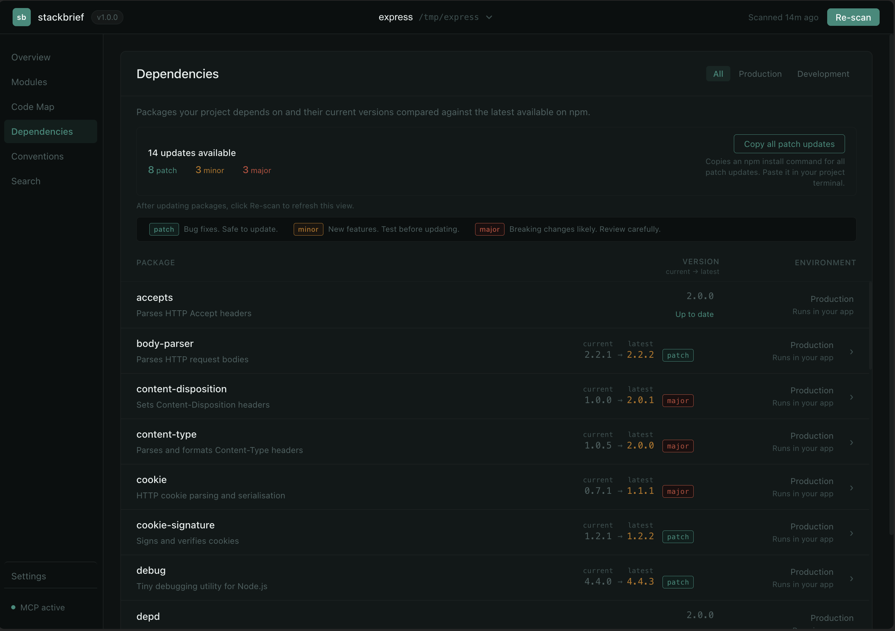
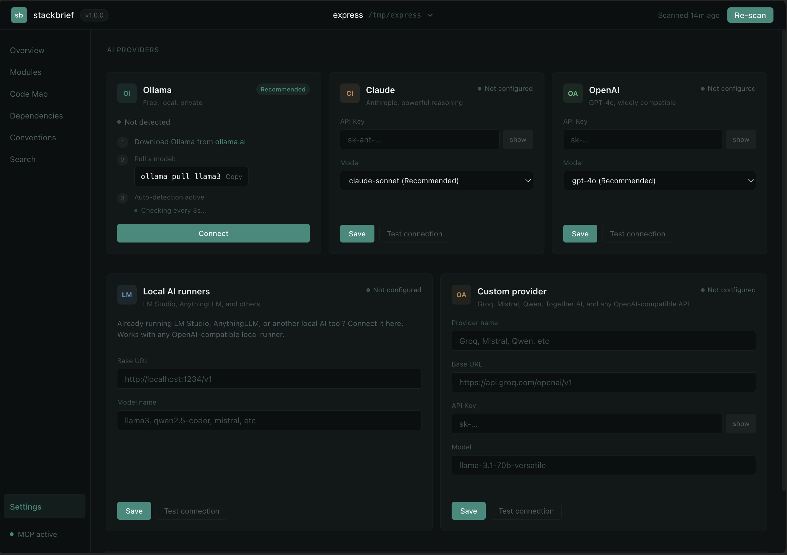

# stackbrief

Visual codebase intelligence for AI coding tools.

[](https://www.npmjs.com/package/stackbrief)
[](https://opensource.org/licenses/MIT)
[](https://nodejs.org)

---

stackbrief scans your codebase and opens a local dashboard showing your architecture, modules, dependencies, and conventions. It gives AI tools like Claude Code and Cursor persistent context about your project so they never lose it between sessions. Works with Ollama, Claude, and OpenAI. No config files. No cloud.

---

## Quick start

```bash
npx stackbrief scan
```

That is it. The dashboard opens at `localhost:3000`.

---

## What you get

- Interactive code map showing your full codebase architecture as a tree diagram
- Dependency version comparison against the npm registry — see what needs updating at a glance
- Convention detection: naming style, async patterns, error handling, module system
- Context health score — how well your codebase is understood by AI tools
- AI chat about your codebase, works with Ollama (free, local), Claude, or OpenAI
- MCP server so Claude Code and Cursor pull context automatically before every session
- Zero config, fully local, no cloud, no accounts

---

## Screenshots

### Overview


### Code Map


### Dependencies


### AI Chat Setup


---

## AI Chat

Configure any provider from the dashboard UI. No environment variables needed.

**Ollama** — recommended, free, local, private  
Install from [ollama.ai](https://ollama.ai), pull any model, stackbrief detects it automatically.

**Claude**  
Paste your API key from [console.anthropic.com](https://console.anthropic.com) into Settings.

**OpenAI**  
Paste your API key from [platform.openai.com](https://platform.openai.com) into Settings.

---

## MCP Integration

stackbrief runs an MCP server on port 3001. Add this to your Claude Code or Cursor MCP config:

```json
{
  "mcpServers": {
    "stackbrief": {
      "url": "http://localhost:3001"
    }
  }
}
```

Claude Code will pull your codebase context automatically before every session. You can also add the generated `CLAUDE.md` to your repo root — stackbrief writes it on every scan.

---

## How it works

1. Scans your repo recursively, reads file structure and source files
2. Detects framework, architecture pattern, modules, dependencies, and coding conventions
3. Opens a local dashboard at `localhost:3000`
4. Generates `CLAUDE.md` in your repo root with structured context
5. Starts an MCP server at `localhost:3001`
6. Your AI tools pull context automatically on each session start

---

## Requirements

Node.js 18 or above.

---

## Development

```bash
git clone https://github.com/ragavtech/stackbrief
cd stackbrief
npm install
npm run build
node dist/cli.js scan /path/to/your/project
```

---

## License

MIT

---

Built by [ragavtech](https://github.com/ragavtech)
